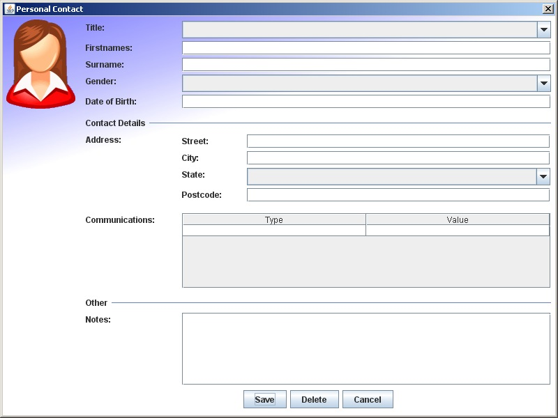

# CONTACTS WEB APP VIDEOS

#### STEP-BY-STEP USING HTML, CSS & JS DOM MANIPULATION

[STARTER CODE: ( if you want to code along )]
(https://github.com/10-3-pursuit/form-events-starter-jd)

## ADDRESS BOOK DEMO VIDEOS

1. [Application Demo](https://drive.google.com/file/d/150zIUDqTt3mQk6TEcNgEH4NN0fVzc48h/view?usp=sharing)

1. [Code Walkthrough](https://drive.google.com/file/d/150zIUDqTt3mQk6TEcNgEH4NN0fVzc48h/view?usp=sharing)

1. [Prevent page refresh when submitting form](https://drive.google.com/file/d/1fVBlh8i8sYGYR3_x2YMWmn2MPkpmm1Qn/view?usp=sharing)

1. [Grab Input Values from the Browser(https://drive.google.com/file/d/17tVO-KeRpePQQ51Enn2LdUyFUAYCBGfd/view?usp=sharing)

1. [Use Input Values to add a Contact to the DOM](https://drive.google.com/file/d/1EZK4GuM2DvDAa8sXKiSIlMbX8HF2-XYS/view?usp=sharing)

1. [Refactor Functions to have a single concern](https://drive.google.com/file/d/1dplKaFbnjoRnjnYHgPfpJVdQTiHn7s_D/view?usp=sharing)

1. [Reset form inputs](https://drive.google.com/file/d/1XzTW4HSbQ3mHSLe-Y52gB_JCwhQyaqy3/view?usp=sharing)

1. [Remove An added LI](https://drive.google.com/file/d/1xTWXwQWuZJnDvQyUmDIRyzQEL3zu0-U9/view?usp=sharing)

1. [Remove static LI that was already hard coded in HTML](https://drive.google.com/file/d/1GdX0QCENYOmd8VoY0-96A7FKBj6WsoSx/view?usp=sharing)

1. [Increment the count in the header](https://drive.google.com/file/d/1oVttfZRCOrzZz8saII69U9dSxp8e-xtF/view?usp=sharing)

[ADDRESS BOOK CLASS CODE INCLUDING COMMENTED CODE]
(https://github.com/10-3-pursuit/address-book-class-code)
