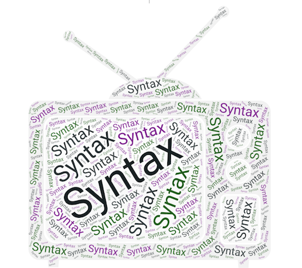

# SYNTAX SECTION

Quick references to JavaScript Syntax

1. [Functions](functions.md)
1. [If Statements](if-conditional.md)
1. [Modulus](modulus.md)
1. [For Loop](for-loop.md)
1. [While Loop](while-loop.md)
1. [Array](array.md)
1. [Array Methods](array-methods.md)
1. [String Methods](string-methods.md)
1. [Command Line Basics](command-line-basics.md)
1. [Git and Github Navigation](git-github-basics.md)
1. [VSCode Shortcuts](../assets)
1. [Git Cheat Sheet](../assets)

**[Syntax Videos & Explanations](https://github.com/10-3-pursuit/10-3-resources/blob/main/javascript-essentials.md)**

[Home](https://github.com/10-3-pursuit/10-3-resources/tree/main)