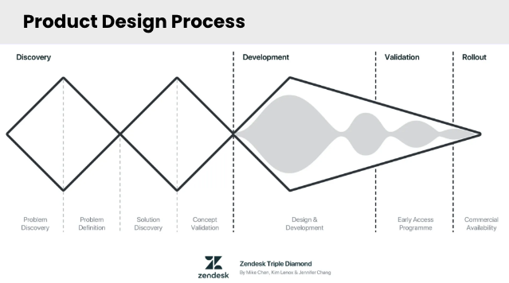

# UX OVERVIEW with Robin Yipp

Here are video time stamps & tangible resources for the comprehensive overview of UX by Robin Yipp.
Subjects include Visual Design, User Stories, Color Theory, Typography, Style Guides, UI Kits and more.

**[VIDEO LINK](https://us06web.zoom.us/rec/share/7yN75eLMSttC_eWtmt7onNBFkz27fWMVTLEm0nXEe1QnefnmCEpJUGtCWq6PT5q1.fBXMtyB5Ql2Lzl6c?startTime=1717524148000)**

**[PRESENTATION DECK](https://docs.google.com/presentation/d/1LtwgXNQSiya-rs2BGqOpFGfsPGnz3jAtpVAV7NiSzo4/edit#slide=id.g420132f636_0_109)**

## VIDEO TIMESTAMPS

1.  **Intro to UX Design** (_00:00 - 08:09_)
1.  **UX Design Principles 101** (_08:09 - 25:36_)
    - Visual Design Principles Intro (_08:09 - 10:27_)
    - Scale (_10:28 - 11:59_)
    - Visual Hierarchy (_11:59 - 14:08_)
    - Balance (_14:09 - 16:50_)
    - Contrast (_16:51 - 18:34_)
    - Proximity (Gestalt Principle) (_18:36 - 20:08_)
    - 10 Usability Heuristics (_20:09 - 25:35_)
1.  **Designing Your First MVP** (_25:36 - 59:18_)
    1.  **Product Design Process**
        1. Overview (_25:38 - 27:10_)
        1. Phase 1: _Discovery_ (_27:11 - 29:12_)
        1. Phase 2: _Define_ (_29:13 - 36:48_)
           - Intro (_29:13 - 29:55_)
           - Choose Problem Space ("How Might We") (_29:56 - 31:18_)
           - User Story (_31:19 - 33:53_)
           - Competitive Analysis (_33:54 - 36:48_)
        1. Phase 3: _Develop_ (_36:50 - 58:28_)
           - User Flow Diagram (_37:14 - 43:43_)
           - Site Maps - (_43:44 - 46:09_)
           - Wireframes - (_46:10 - 58:28_)
        1. Phase 4: _Setting Up for Implementation_ (_58:29 - 59:18_)
    1.  **Style Guide & UI Kit** (_59:19 - 1:24:50_)
        1. _**Style Guide**_
           - Intro (_1:00:21 - 1:04:50_)
           - Style guide examples (_1:04:51 - 1:07:00_)
           - Style Guide Recap/Recommendations (_1:07:00 - 1:08:40_)
           - Style Guide Elements (_1:08:40 - 1:22:03_)
             1. Color Theory, Color Psychology & Emotional Associations (_1:08:40 - 1:12:55_)
             1. 60-30-10 Rule (_1:12:56 - 1:14:23_)
             1. Typography (_1:14:23 - 1:22:03_)
        1. _**UI Kits**_ - Component Libraries (_1:22:03 - 1:24:50_)
1.  **Recap/Bringing Your App to life** (_1:24:50 - 1:27:08_)
1.  **Resources** (_1:27:08 - 1:30:22_)
1.  **Mentor Collaboration Recommendations** (_1:30:23 - 1:33:16_)
1.  **Outro & Questions** (_1:33:17 - 1:52:21_)

## DECK REFERENCES & SLIDE NUMBERS

1. **User Centered Design** (6 - 8)
1. **UX Design Principles 101** (9 - 31)
   - Visual Design Principles (11 - 13)
   - Scale (14 - 15)
   - Hierarchy (16 - 17)
   - Balance (18 - 21)
   - Contrast (22 - 23)
   - Proximity (24 - 25)
   - Usability Heuristics (26 - 31)
1. **Design Your First MVP** (32 - 79)
   1. _**Product Design Process**_ (33 - 55)
      - Overview (33 - 35)
      - Phase 1: Discover (36)
      - Phase 2: Define (37 - 42)
        - Choose Space (38)
        - User Story (39 - 40)
        - Competitive Analysis (41 - 42)
      - Phase 3: Develop (43 - 53)
        - User Flow Diagram (44 - 47)
        - Sitemap (48 - 49)
        - Wireframes (50 - 53)
      - Phase 4: Setting Up For Implementation (54 - 55)
   1. _**Style Guide & UI Kit**_ (56 - 79)
      - Intro (56 - 62)
      - Color Theory (63 - 67)
      - Typography (68 - 74)
      - Design Components & Links (75)
      - Optional Links (79)
1. **Collaborating with Your Mentors** (80)

## EXTERNAL LINKS FROM THE DECK

- [Usability Link](https://digital.gov/topics/usability/)
- [Color Contrast Checker](https://webaim.org/resources/contrastchecker/)
- [10 Usability Heuristics for User Interface Design](https://www.nngroup.com/articles/ten-usability-heuristics/)
- [Design principles](https://www.interaction-design.org/literature/topics/design-principles)
- [Fisamiq](https://www.figma.com/community/file/880190575678066152/fisamiq-low-fidelity-ui-kit)
- [Screenlane](https://screenlane.com/) - Mobile UI Designs
- [Explore real-world designs from the best products](https://refero.design/apps)
- [UX Archive](https://uxarchive.com/)
- [Web design inspiration catalog - mobile](https://www.curated.design/?category=mobile-apps)
- [Web design inspiration catalog - web](https://www.curated.design/?category=web-apps)
- [The world’s largest mobile and web design library](https://mobbin.com/browse/web/apps)
- [Mailchimp Pattern Library & Design Guide](https://ux.mailchimp.com/patterns/color)
- [Yelp Design Guide](https://www.yelp.com/styleguide/ingredients)
- [UI Component States Lesson](https://app.uxcel.com/courses/ui-components-n-patterns/component-states-499)
- [Accessible color palette generator](https://venngage.com/tools/accessible-color-palette-generator)
- [Coolors Color Palette generator](https://coolors.co/)
- [The Responsive Website Font Size Guidelines](https://www.learnui.design/blog/mobile-desktop-website-font-size-guidelines.html)
- [Font Pair - compare font combinations](https://www.fontpair.co/all)
- [Chrome DevTools - mobile devices extension for testing devices](https://developer.chrome.com/docs/devtools/device-mode)
- [Google Fonts](https://fonts.google.com/)
- [Line Lengths](https://fonts.google.com/knowledge/glossary/measure_line_length)
- [Readability: The Optimal Line Length](https://baymard.com/blog/line-length-readability)
- [Uber Based Web Components](https://baseweb.design/components/)
- [Semantic UI Web Components](https://semantic-ui.com/introduction/getting-started.html)
- [Clarity Design Components](https://clarity.design/documentation/accordion)
- [Open Source Design Systems](https://open-ui.org/design-systems/)
- Free Stock Photos
  - [Unsplash](https://unsplash.com/)
  - [Pixabay](https://pixabay.com/)
  - [Burst](https://www.shopify.com/stock-photos)
- Illustrations
  - [Undraw](https://undraw.co/)
  - [Blusch Design](https://blush.design/)
  - [Humaans](https://www.humaaans.com/)
  - [MixKit](https://mixkit.co/free-stock-art/)
  - [Art Box](https://artbox.today/)
- Icons
  - [The Noun Project](https://thenounproject.com/)
- CSS Templates
  - [Tailwind UI](https://tailwindui.com/templates)
- [Animation/Easings](https://easings.net/)
- [Avatar Library](https://www.dicebear.com/)
- [WHYSIWYG Editors](https://github.com/JefMari/awesome-wysiwyg-editors)
- [Material Design Library](https://mui.com/)
- [Frontend Code Snippets](https://codepen.io/)
