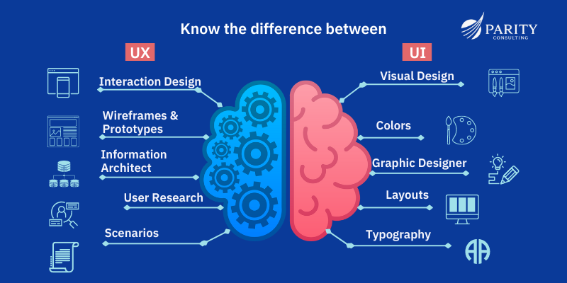

# USER EXPERIENCE RESOURCES

1. [The Ultimate Guide to Designing for the User Experience](https://blog.hubspot.com/marketing/ux-user-experience)

1. [Nielsen’s Heuristics: 10 Usability Principles To Improve UI Design](https://aelaschool.com/en/interactiondesign/10-usability-heuristics-ui-design/)

1. [How Long Users Stay on Websites](https://www.nngroup.com/articles/how-long-do-users-stay-on-web-pages/)

1. [User Personas Video](https://www.youtube.com/watch?v=v6EWN4EjHM0&t=6s)

1. [User Persona Examples](https://qubstudio.com/blog/4-examples-of-ux-personas/)

1. [Website Wireframe Beginner's Guide: Processes, Tools, & Examples](https://blog.hubspot.com/website/website-wireframe?hubs_content=blog.hubspot.com%2Fmarketing%2Fux-user-experience&hubs_content-cta=website%20wireframes)

1. [UX vs UI](https://intuji.com/ux-vs-ui-design-difference-guide/)

1. [UX Case Studies](https://htmlburger.com/blog/ux-case-studies/)

1. [From Ideation to Launch: The Design of Asana's Goals Feature](https://www.youtube.com/watch?v=s1USU36g4Fw) - [Actual Asana App](https://app.asana.com/0/goals/1190689591916349/list?v=1.0&view_mode=domain_level)

#### Good UX/UI

Below are two links to examples of Good UX/UI. They are the 2023 Winners of the [Webby Awards](https://www.webbyawards.com/). One in the _Shopping & Retail Websites and Mobile Sites_ category & the other in the _Diversity, Equity & Inclusion Websites and Mobile Sites_ category respectively.

1. [Earthform](https://basement.studio/)

1. [Crafted](https://experiencecrafted.com/)

#### Case Studies

Below are examples of a UX Case Study Analyses.

Investigate and note the structure of or more of these Case Studies

1. [Jambb](https://www.finna.wang/jambb)
1. [Memento](https://mahsakeyhani.com/memento.html)
1. [Perfect Recipes App](https://blog.tubikstudio.com/case-study-recipes-app-ux-design/)

[**UX Tools**](ux-tools.md) - tools to build low and high fidelity wireframes, mind maps, workflow charts etc.

[Project Tools & Assets](project-tools)

[Home][def]

[def]: README.md
